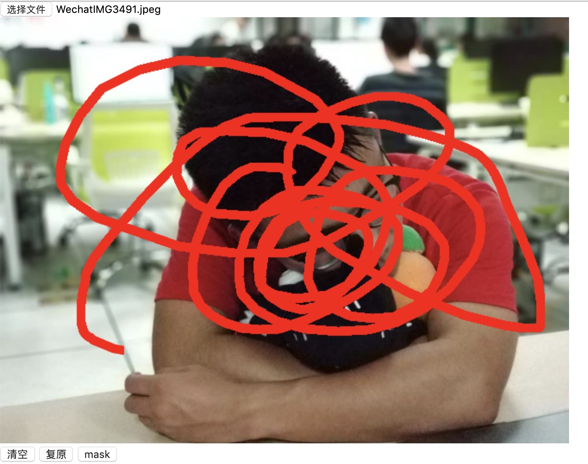

# UI for inpainting

### 开启流程
#### 前端页面放到服务器上，并配置nginx转发
```
...
配置好以后前端页面访问的是云服务器上的
发送到后端的请求会被转发到本地配置比较好的客户端
```
#### 服务器运行frps.ini
```
cd /opt/frp/frps/
./frps -c frps.ini
```
#### 本地运行frpc.ini
```
cd ~/myGit/frp
./frpc -c frpc.ini
```
#### 本地运行后台程序
```
npm run dev
```
#### 本地处理完图片以后需要把结果上传到服务器

### 操作流程
#### 1、访问
- 前端：`visit ./fnt/index.html`
- 后端：`npm run dev`

#### 2、选择图片

#### 3、绘制掩膜


#### 4、点击修复
- 20s 左右返回修复结果，可调整（./fnt/index.js）

#### 5、mask 绘制上传接口
- 开始绘制之前把./fnt/index.js line 221 and line 222 注释取消掉<br>
- 点击mask 按钮绘制<br>
- mask 位置./mask<br>
- mask 命名格式为：1_white_zero.jpg  1_black_zero.jpg

#### 6、批量处理图片与定量评估
- 代码：./utils/oneHundred.js
- 批处理图片位置：可自行指定
- 批处理mask 位置：./mask
- 预设时间为25s 一副，一百张图片大概需要半个多小时

